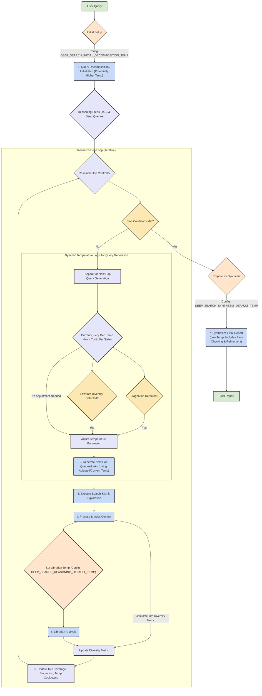
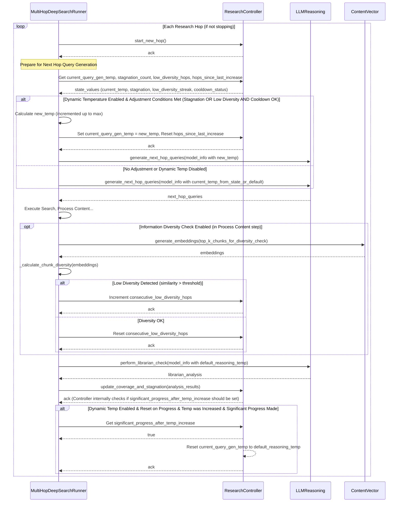
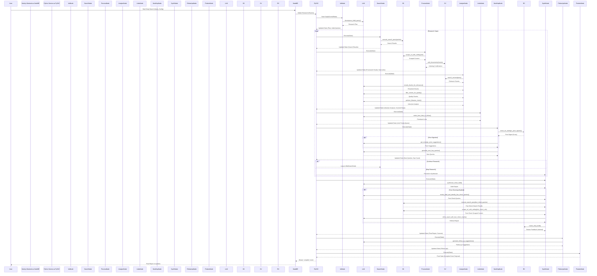

# Deep Search Architecture & Knowledge System

## 1. Overview

This section provides a high-level summary of the Deep Search agent's purpose, its core methodology involving multi-hop research, and its goal of delivering comprehensive, evidence-based reports. It also introduces the concept of agent personas for user communication.

The Deep Search agent is designed to perform comprehensive, iterative research on a given user query. It employs a multi-hop approach, progressively gathering, analyzing, and synthesizing information from various web sources, **uploaded documents,** and its internal knowledge base (a vector store). The goal is to provide users with a detailed report that addresses their query, supported by evidence from processed sources. **Agent personas, such as the "Research Strategist," "Search Agent," "Librarian," "Document Analyst," and "Synthesizer," provide progress updates to the user, enhancing transparency.**

## 2. Core Components & Flow

This chapter details the main architectural building blocks of the Deep Search system, outlining the division between the Node.js frontend/orchestration layer and the Python backend responsible for the actual research execution. It sets the stage for understanding how a research task moves through the system.

The system is broadly divided into a Node.js layer (API gateway and tool orchestrator) and a Python backend service (`deep_search_service`) that performs the core research tasks.

### 2.1. Request Initiation (Node.js)

This sub-section explains the initial phase of a Deep Search task, focusing on the responsibilities of the Node.js layer. It covers how user queries and configurations are received, models and API keys are prepared, document ingestion is triggered, and the main research task is launched in the Python backend.

-   **Source:** `src/mcp_tools/deep_search/deepSearchTool.js` (for in-chat tool usage) and `src/controllers/deepSearchApiController.js` (for direct API calls).
-   **Functionality:**
    -   Gathers user query and configuration parameters (e.g., LLM models to use, search providers, research depth, **file IDs for uploaded documents**).
    -   Resolves model names/IDs to full model information (`reasoningModelInfoFull`, `synthesisModelInfoFull`).
    -   Fetches necessary API keys for external services (search engines, LLMs) and compiles them into `allApiConfigsForPython`.
    -   **Document Ingestion Trigger:** If `fileIds` are provided, it calls `pythonResearchService.ingestDocumentsForTask`, passing the file details along with `reasoningModelInfoFull` and `allApiConfigsForPython` to the Python backend for pre-processing and analysis of uploaded documents. **"Document Analyst" persona messages are yielded during this phase.**
    -   Constructs a request payload for the main Python research task. This includes `model_info` objects and the `user_id`.
    -   Initiates the main research task via `pythonResearchService.initiateResearch()`.
    -   Handles Server-Sent Events (SSE) streamed back from the Python service to relay progress and results to the client.

### 2.2. Python Backend (`deep_search_service`)

This sub-section delves into the Python service where the intensive research work occurs. It introduces the key classes and modules like `ResearchController`, `LLMReasoning`, and `MultiHopDeepSearchRunner`, and describes the step-by-step orchestration of the research process, including document analysis and the multi-hop cycle.

The core logic now resides in `src/python_services/deep_search_service/research_graph.py`, which defines the research process as a stateful **LangGraph**. This graph orchestrates the flow between distinct **nodes**, with various "agents" (like the Research Strategist, Search Agent, Librarian, etc.) implemented as **services** that these nodes interact with.

**LangGraph (`research_graph.py`):**
-   **Defines the overall research workflow as a directed graph of nodes and edges.**
-   **Manages the `OverallState` (defined in `models.py`) which is passed between nodes.**
-   **Each node represents a specific step in the research process (e.g., web search, content analysis, synthesis).**
-   **Conditional edges determine the next node based on the current state.**

**Research Controller (Service):**
-   **The `ResearchComptroller` (in `sub_workers/research_comptroller.py`) acts as a service that monitors and guides the research process.**
-   **It provides functions for checking certain hard constraints (like total URLs scraped), signaling strategic pivots, and reviewing the final draft. The primary logic for `max_hops` in conjunction with Comptroller credits is managed by the `should_continue_hopping` conditional edge in `research_graph.py`.**
-   **Its logic is invoked by various graph nodes (e.g., `prepare_next_hop_node`, `synthesize_report_node`).**
-   **It tracks state for dynamic LLM temperature adjustments (e.g., `current_reasoning_dynamic_temperature`, `hops_since_last_temp_increase`, `consecutive_low_diversity_hops`) which are managed within the `OverallState` and influenced by graph nodes.**
-   **`agent_dialogue.py` is used by graph nodes to format and provide persona-based messages (e.g., "Research Strategist," "Search Agent," "Librarian") for SSE updates, enhancing user experience.**

**LLM Call Handling (`llm_reasoning.py`):**
The `LLMReasoning` sub-worker is responsible for executing LLM calls. These calls are made directly by the LangGraph nodes, which pass the necessary `model_info` (including temperature) and `api_config`.
-   **Core Planning Method (`extract_research_plan`):** This new method in `LLMReasoning` uses a "Research Extractor" prompt. It breaks the user's query into "Required Data Points," plans retrieval strategies (ASK_LLM, ENTITY_OVERVIEW, WEB_SEARCH, etc.), and identifies if the query is "fact-centric," extracting the `core_entity` and `target_attributes`.
-   **Compatibility Adapter (`decompose_initial_query`):** This method now primarily calls `extract_research_plan` and adapts its detailed output to the older format (table_of_contents, seed_queries) for broader system compatibility, while also passing through the new strategy-related fields.
-   **Fact Probing Methods:**
    -   `get_direct_fact`: For "ASK_LLM:" prefixed data points, attempts to get a direct answer from the LLM (temp 0.0).
    -   `get_entity_overview`: For "fact-centric" strategy, gets a broad overview of the `core_entity` (low temp).
    -   `extract_specific_attributes_from_text`: For "fact-centric" strategy, extracts attribute values from the entity overview (temp 0.0).
-   **Verification Query Formulation (`formulate_verification_query`):** Generates a targeted web search query to verify facts proposed by `get_direct_fact` or `extract_specific_attributes_from_text`.
-   **Librarian Check Enhancement (`perform_librarian_check`):** Now accepts `proposed_fact_to_verify`. Its prompt is updated to guide the LLM in confirming/denying this fact based on retrieved web content, influencing the `verification_outcome` in `LibrarianAnalysisResult`.
-   **Dynamic Temperature Adjustment Strategy:**
    -   **Enabled by Configuration:** Controlled by `DEEP_SEARCH_ENABLE_DYNAMIC_TEMPERATURE` and related settings in `config.py`.
    -   **Initial Planning Temperature:** The `extract_research_plan` LLM call uses a configured low temperature (`temperature_for_planning`, e.g., 0.1) for precise planning.
    -   **Reasoning Default Temperature:** Most other reasoning LLM calls (e.g., librarian checks, fact-check query identification) use a configured default (`DEEP_SEARCH_REASONING_DEFAULT_TEMP`).
    -   **Synthesis Default Temperature:** Synthesis and refinement calls use a configured low temperature (`DEEP_SEARCH_SYNTHESIS_DEFAULT_TEMP`) for factual precision.
    -   **"Stuck" Adjustment for Query Generation:** The temperature for `generate_next_hop_queries` can be dynamically increased if the `ResearchComptroller` detects stagnation or low information diversity.
    -   **Temperature Reset:** If a temperature increase leads to significant progress, it can be reset.
-   **Synthesis Refinement:** The `synthesize_initial_draft` method can now revise a previously generated draft based on specific feedback from the `ResearchComptroller`, aiming to iteratively improve report quality rather than always regenerating from scratch.
-   **Optimized Fact-Checking:** The system now tracks claims identified for fact-checking within a synthesis/refinement cycle (`claims_previously_fact_checked_in_cycle` in `OverallState`) to prevent redundant verification of the same claims if multiple refinement iterations occur for a given draft.
-   **LLM Call Routing (Provider Handling):**
    -   If `model_info` specifies `provider_name: 'local'`, calls are routed to an internal Node.js API (`local_active_model_node_api`).
    -   Other providers are routed via LiteLLM.

**Document Ingestion & Analysis (`main.py`, `document_processor.py`):**
-   **Endpoint:** `/tasks/{task_id}/ingest_documents` in `main.py` handles requests from `deepSearchTool.js`.
-   **Request Model:** Uses `models.IngestDocumentsRequest`, which includes `reasoning_model_info` and `api_config`.
-   **Processing:**
    -   For each uploaded document, text and tables are extracted.
    -   `document_processor.py`'s `analyze_document_content` function is called. This function:
        -   Chunks text content and processes extracted tables.
        -   For each text chunk and table, it uses `LLMReasoning` (with the provided `reasoning_model_info` and `api_config`) to:
            -   Generate summaries (`extracted_summary` for text, `table_summary` for tables).
            -   Extract typed entities (`extracted_entities`).
            -   Extract typed relationships (`extracted_relationships`).
    -   The extracted insights, along with flags like `is_from_uploaded_doc: True`, `original_document_id`, and `original_document_name`, are added to the metadata for each processed item.
    -   These items (original text/table markdown + rich metadata) are then added to the vector store (`ContentVector`) under the `task_id` as the `group_id`.
-   **Persona:** "Document Analyst" persona messages are primarily yielded from `deepSearchTool.js` before and after calling the Python ingestion endpoint. The Python service returns a completion message.

### 2.3. Dynamic Temperature Adjustment Flow

The following diagram illustrates the flow of dynamic LLM temperature adjustment, particularly for query generation, based on factors like stagnation and information diversity.



**Diagram Explanation:**
-   **Initial Setup & Decomposition (A, B_Setup, B):** The process starts with the user query. A specific temperature (potentially higher, from `DEEP_SEARCH_INITIAL_DECOMPOSITION_TEMP`) is used for the initial "Query Decomposition / Initial Plan" to generate the Table of Contents (ToC) and seed queries.
-   **Research Hop Loop (D_LoopControl to T_UpdateState):**
    -   The loop continues as long as stop conditions (K_CheckStop) are not met.
    -   **Dynamic Temperature for Query Generation (L_QueryGenPrep to P_QueryGen):** Before generating next-hop queries, the system checks for stagnation or low information diversity. If triggered (and cooldown conditions are met), the temperature parameter for the "Generate Next Hop Queries/Links" LLM call is adjusted (increased). Otherwise, the controller's current reasoning temperature is used.
    -   **Other Steps:** Search, content processing (which includes calculating the info diversity metric), and Librarian Analysis (which uses the default reasoning temperature) proceed.
    -   The state (ToC coverage, stagnation count, diversity metrics, temperature cooldowns) is updated at the end of the hop.
-   **Synthesis (U_SynthPrep, V, W):** When the loop stops, a specific low temperature (`DEEP_SEARCH_SYNTHESIS_DEFAULT_TEMP`) is set for the final report synthesis and refinement stages to ensure factual and coherent output.

This dynamic temperature approach, inspired by the need for both exploration (when stuck or facing low diversity) and exploitation (focused reasoning and synthesis), aims to improve the agent's adaptability and the quality of its research.

A sequence diagram illustrating the interactions for dynamic temperature adjustment during query generation:

**Sequence Diagram Explanation:**
- This diagram focuses on the interactions between `MultiHopDeepSearchRunner` (Runner), `ResearchController` (RC), `LLMReasoning` (LLM), and `ContentVector` (CV) for dynamic temperature adjustment during the "generate next hop queries" phase of a research hop.
- **State Retrieval:** The Runner queries the RC for current temperature, stagnation count, low diversity streak, and cooldown status.
- **Temperature Adjustment Decision:** Based on these states and configuration, the Runner decides if a temperature increase is needed.
- **LLM Call:** The `generate_next_hop_queries` call to LLMReasoning uses either the adjusted temperature or the current/default temperature.
- **Diversity Calculation:** After content processing, the Runner (using CV for embeddings) calculates information diversity.
- **State Update:** The RC's state (low diversity streak, stagnation, coverage, and potentially the `significant_progress_after_temp_increase` flag) is updated.
- **Temperature Reset:** If a temperature increase was effective and reset is enabled, the Runner instructs the RC to reset the dynamic temperature to its default for reasoning tasks.

### 2.4. Deep Search LangGraph Flow Diagram

```mermaid
graph TD
    A[User Query] --> B(Node: Initialize Task);

    subgraph Python Backend (LangGraph)
        direction LR
        B --> C(Node: Web Search);
        B --> D(Document Ingestion & Analysis);
        D --> C;

        C --> E(Node: Process Content);
        E --> F(Node: Analyze Content);
        E --> G(Node: Extract Links);

        F --> H(Node: Prepare Next Hop);
        G --> H;

        H -- Continue Research --> C;
        H -- Synthesize Report --> I(Node: Synthesize Report);

        I --> J(Node: Generate Follow-ups);
        J --> K(Node: Finalize Task);
        K --> L(End);
    end

    subgraph Services
        LLM[LLMReasoning Service]
        SS[SearchScrape Service]
        CV[ContentVector Service]
        RC[ResearchComptroller Service]
    end

    B --- LLM;
    C --- SS;
    E --- SS;
    E --- CV;
    F --- LLM;
    F --- CV;
    G --- LLM;
    H --- LLM;
    H --- RC;
    I --- LLM;
    I --- RC;
    J --- LLM;

    classDef nodeStyle fill:#c9daf8,stroke:#333,stroke-width:2px;
    classDef serviceStyle fill:#d9ead3,stroke:#333,stroke-width:2px;

    class B,C,E,F,G,H,I,J,K nodeStyle;
    class LLM,SS,CV,RC serviceStyle;
```



## 3. Data Management & Embeddings

This chapter focuses on how the Deep Search agent handles data, particularly the storage and retrieval of information using a vector store and the generation and use of text embeddings. Understanding this is key to grasping how semantic search and relevance are achieved.

### 3.1. Vector Store

This sub-section describes the technology (LanceDB) and purpose of the vector store. It details the schema of the indexed data, including metadata for both web-scraped content and uploaded documents, and how data is organized.
-   **Technology:** LanceDB (local, embedded vector database).
-   **Purpose:** Enables efficient semantic search over text chunks. It stores text content, its vector embedding, and associated metadata.
-   **Schema (`IndexedChunkMetadata` in `models.py`):** Includes `chunk_id`, `original_url`, `page_title`, `chunk_index_in_page` (or `item_index_in_doc` for tables), `depth`, `query_phrase_that_led_to_page`, `content_preview`, trust signals (`trust_score`, `is_https`, `domain_age_days`), `is_summary_of_url`.
    -   **For Uploaded Documents/Chunks:** Also includes `is_from_uploaded_doc: True`, `original_document_id`, `original_document_name`, `extracted_summary`, `extracted_entities` (list of `TypedEntity`), `extracted_relationships` (list of `TypedRelationship`).
    -   **For Table Analysis from Uploaded Docs:** Includes `table_summary`, `key_insights_from_table`, `potential_entities_in_table`.
-   **Organization:** Typically uses a `group_id` (often the `task_id`) to isolate data per research session. A global group ID can be configured for a shared knowledge base.

### 3.2. Embedding Model & Chunking

This part explains the type of embedding models used, their role in converting text to vectors, and the process of text chunking. It clarifies how raw text is prepared for effective semantic representation and search.
-   **Embedding Model Type:** Sentence Transformer models (e.g., from Hugging Face library). The default model is specified in `config.py` and can be overridden by system settings in the database.
-   **Embedding Purpose:** To convert variable-length text chunks into fixed-size dense vector representations.
-   **Embedding Usage:** Embeddings are generated for all processed text chunks before storage in LanceDB. Query texts are also embedded.
-   **Text Chunking:** The `ContentVector` sub-worker utilizes `langchain.text_splitter.RecursiveCharacterTextSplitter`. This process operates on (potentially coreference-resolved) text.

## 4. Knowledge Extraction & Ranking

This chapter outlines the mechanisms by which the Deep Search agent extracts structured knowledge from unstructured text and how it ranks the relevance of information. This includes LLM-driven extraction techniques and various ranking signals.

### 4.1. Knowledge Extraction

This sub-section details the specific LLM-driven processes for extracting information, such as query decomposition, coreference resolution, typed entity and relationship extraction (including predicate normalization), and how these extracted structures are associated with content and used in analysis and synthesis, especially concerning uploaded documents.
-   The system aims for an "Implicit KG" by extracting and leveraging structured information from text.
-   **Chunk-based Knowledge:** Primary knowledge is in processed text chunks.
-   **LLM-driven Extraction (Page-Level, then filtered to Chunks):**
    -   **Query Decomposition & Planning (`extract_research_plan`):** The "Research Extractor" LLM performs initial query breakdown into "Required Data Points," plans retrieval actions (ASK_LLM, ENTITY_OVERVIEW, WEB_SEARCH), and identifies overall strategy (fact-centric vs. general).
    -   **Coreference Resolution (Conditional):** As before.
    -   **Typed Entity & Relationship Extraction:** As before, applied to scraped content and uploaded documents.
    -   **Metadata Association:** As before.
    -   **Librarian Check (`perform_librarian_check`):**
        *   Analyzes retrieved chunks against general reasoning steps or specific proposed facts (if in a verification context from "ASK_LLM" or "Fact-Centric" flows).
        *   Its output now includes `verification_outcome` if a fact verification was performed.
    -   **Synthesis:** As before, with the addition of using `fact_centric_verified_attributes` if that strategy was active.
    -   **Uploaded Document Analysis:** As before.

### 4.2. Ranking & Relevance

This part describes the multi-faceted approach to determining information relevance, covering search engine ranking, vector similarity, hybrid search capabilities, LLM-based re-ranking, graph-aware retrieval, trust scoring, and query expansion strategies.
-   **Search Engine Ranking:** Initial URLs are sourced from external search engines.
-   **Vector Similarity:** LanceDB ranks chunks by vector similarity to the query.
-   **Hybrid Search (FTS & Vector):** LanceDB's `search()` method supports FTS queries (via `keyword_filter`) alongside vector queries for effective hybrid search. `ContentVector` allows FTS-only searches if `query_vector` is `None`.
-   **LLM Explicit Re-ranking:** An LLM re-ranks top-N retrieved chunks based on query context and source trust signals.
-   **Graph-Aware Retrieval Simulation (Secondary Expansion):** After initial vector/hybrid retrieval, key typed entities are identified from the top-ranked chunks. Secondary FTS-only searches are then performed for these entities to find related "expansion chunks," which augment the context for the Librarian Check.
-   **Use of Summaries in Retrieval (Enhanced):** If a document-level summary is highly relevant from vector search, a few top granular chunks from its source URL are also pulled in to provide more detail.
-   **Source Trust Scoring (Enhanced Heuristics):** A provisional trust score is calculated for sources based on HTTPS status, domain age (via WHOIS), TLD heuristics, and simple URL pattern analysis. This score is used as a factor to adjust the LLM-based re-ranking scores.
-   **Query Expansion/Transformation:**
    -   The initial user query is decomposed into sub-queries by an LLM.
    -   For subsequent research hops, new queries are generated by an LLM (`generate_next_hop_queries` in `llm_reasoning.py`). This process is enhanced to produce multiple diverse query variations (Multi-Query Strategy) for each uncovered reasoning step, based on insights from the Librarian Check. This aims to improve coverage and explore different facets of the research topic.
    -   **Link Prioritization:** Links extracted from pages are added to a priority queue, but the current prioritization logic is basic (e.g., depth-based).
    -   **Persistent Domain Trust Profiling Integration:**
        -   **Discovery & Persistence:** The `SearchScrape` sub-worker (`search_scrape.py`), when processing URLs, identifies the domain.
        -   It interacts with a central SQLite database (`data/mcp.db`) and the `domain_trust_profiles` table.
        -   If a domain is encountered for the first time (not found in `domain_trust_profiles`), it is **inserted** into the table. Key fields set upon insertion include:
            -   `domain`: The new domain name.
            -   `last_scanned_date`: Set to `NULL`, making it eligible for processing by the dedicated domain trust update script.
            -   `reference_count`: Initialized to `1`.
            -   `is_https`, `domain_age_days`: Populated based on live checks.
            -   An initial provisional `trust_score` is also set.
        -   If an existing domain profile is found, its `reference_count` is **incremented**, and `updated_at` is refreshed.
        -   **Purpose:** This ensures that domains discovered during deep search operations are fed into a persistent, long-term trust scoring system.
        -   **External Scoring Script:** A separate Python script (`scripts/update_domain_trust_scores.py`) periodically queries the `domain_trust_profiles` table. It selects domains that are due for an update (e.g., `last_scanned_date` is `NULL` or old) and have a `reference_count` above a certain threshold (e.g., >= 2). This script then performs more detailed analysis (like outbound link checking) to calculate and update the `trust_score` and other metrics in the database. This decouples the intensive scoring from the real-time deep search process.

## 5. Key Architectural Decisions

This section summarizes the fundamental design choices that shape the Deep Search system, highlighting decisions related to its structure, flow management, use of LLMs, data storage, and operational robustness.

-   **Microservice-inspired Architecture:** Separation of concerns between Node.js (API/gateway, tool orchestration) and Python (compute-intensive AI/ML tasks).
-   **Iterative Multi-Hop Research:** Allows for progressive deepening of research, adapting to findings from previous hops.
-   **`ResearchController` for Flow Management:** Centralizes state and orchestrates the research lifecycle, including persona-based messaging.
-   **LLM-Powered Orchestration:** LLMs are used not just for generation but also for planning (decomposition, next-hop query generation) and analysis (librarian check, fact-check identification).
-   **Local-First Vector Database:** LanceDB provides efficient, local vector search capabilities without external dependencies for this core function.
-   **Modular Python Sub-Workers:** `SearchScrape`, `ContentVector`, `LLMReasoning`, `DocumentProcessor` encapsulate distinct functionalities.
-   **Server-Sent Events (SSE):** For streaming real-time progress and results to the client.
-   **Configuration-Driven:** Many parameters (models, hop counts, providers) are configurable via `config.py` and can be overridden by request parameters.
-   **Retry Mechanisms:** Implemented for LLM calls to improve robustness against transient errors.
-   **Provider Fallback:** Enhanced search execution to try multiple providers if one fails.

## 6. Potential Areas for Iterative Improvement (Current Deep Search Agent)

This chapter identifies specific areas where the current Deep Search agent (as of May 2025) could be enhanced in future iterations, focusing on practical improvements to its existing capabilities.

The current Deep Search agent, with its existing architecture and recent enhancements (May 2025), provides a strong foundation for comprehensive contextual research. The following areas represent potential iterative improvements for this agent, focusing on enhancing its ability to provide grounded, fact-based answers to complex problems efficiently:

-   **User Feedback Integration (Longer Term):**
    -   Use explicit user feedback (e.g., "this source was relevant/irrelevant") to dynamically adjust search parameters or re-rank results for the ongoing session.
    -   Collect feedback to evaluate and iteratively refine LLM prompts for better alignment with user needs for the current Deep Search agent.

## 7. Future Vision: "Deep Research" Agent – Architectural Guidelines for Advanced Precision

This section looks further ahead, proposing architectural guidelines for a more specialized 'Deep Research' agent. It outlines advanced techniques aimed at achieving exceptionally high precision and depth for demanding research tasks.

For tasks demanding exceptionally high precision, scientific rigor, or extraction of very specific factual/legal details, a more specialized "Deep Research" agent could be developed. This agent would build upon the core Deep Search principles but incorporate more advanced (and resource-intensive) techniques. Key architectural guidelines for such an agent would include:

### 7.1. Propositional Embeddings for Factual Precision

This sub-section explores the concept of decomposing text into atomic factual propositions and embedding them individually. It discusses the potential benefits for precise factual recall, alongside the challenges in extraction, context integrity, and system overhead.
-   **Concept:** Implement LLM-based methods to decompose sentences or small text segments into atomic propositions (self-contained factual statements). Each proposition would then be individually embedded.
-   **Pros:**
    -   **Enhanced Precision for Factual Queries:** Enables direct matching against specific facts, significantly improving accuracy for queries like "What is the melting point of X?" or "Who was the CEO of Y in Z year?".
    -   **Reduced Ambiguity:** Isolating facts can help disambiguate information that might be subtly presented in larger text chunks.
    -   **Granular Evidence:** Retrieved propositions can serve as highly targeted evidence snippets.
-   **Cons & Challenges:**
    -   **LLM Reliability for Extraction:** Ensuring accurate and comprehensive proposition extraction across diverse text styles is a major challenge. LLMs might miss facts, generate malformed propositions, or hallucinate.
    -   **Contextual Integrity:** Propositions, being atomic, can lose vital context from the surrounding text. Reconstructing this context during synthesis or for user understanding is crucial and complex.
    -   **Increased LLM Usage:** Requires an additional LLM call for each text segment to be propositionalized, leading to higher token consumption and costs.
    -   **Storage Overhead:** The number of propositions can be an order of magnitude greater than the number of text chunks, leading to significantly larger vector stores and metadata.
    -   **Retrieval Complexity:** Designing effective retrieval strategies over a large set of granular propositions, and then aggregating them meaningfully, is non-trivial.
    -   **Processing Latency:** Additional LLM calls and embedding steps will increase overall task runtime.
-   **Suitability:** Ideal for domains requiring high-fidelity factual recall, legal discovery, or detailed scientific data extraction where the cost of missing a specific detail is high.

### 7.2. Multi-Vector Embeddings for Nuanced, Multi-Faceted Understanding

This part describes generating multiple embeddings for different aspects of each document chunk (e.g., summary, entities, raw text). It examines how this could improve relevance for complex queries while considering the increased complexity and costs.
-   **Concept:** For each document chunk, generate and store multiple distinct embedding vectors, each representing a different "aspect" or "view" of the chunk's content. Examples of aspects include:
    -   A concise summary of the chunk.
    -   The set of key extracted entities.
    -   The raw text of the chunk itself.
    -   The title or heading associated with the chunk's section.
    -   Potentially, question-answer pairs derived from the chunk.
-   **Pros:**
    -   **Improved Relevance for Complex Queries:** Allows different components of a user's query to match different semantic aspects of a document. For instance, a query about "the impact of [TECHNOLOGY] on [INDUSTRY] in [REGION]" could leverage entity embeddings for technology/industry/region and summary/text embeddings for "impact."
    -   **Enhanced Contextual Matching:** Can capture different semantic nuances that a single, monolithic embedding might average out or miss.
    -   **Flexible Retrieval Strategies:** Enables routing parts of a query to search against the most relevant vector aspect, or combining signals from multiple aspects.
-   **Cons & Challenges:**
    -   **Aspect Definition & Generation:** Identifying universally useful aspects and reliably generating their textual representations (if needed before embedding) can be complex and may require additional LLM calls.
    -   **Embedding & Storage Costs:** Multiplies the number of embedding operations and the size of the vector store by the number of aspects.
    -   **Retrieval & Ranking Complexity:** Querying across multiple vector spaces per document and then merging/re-ranking these results is significantly more complex than single-vector search. Developing effective scoring and weighting mechanisms for different aspects is crucial.
    -   **Increased Latency:** More embedding and potentially more complex query execution can increase overall search time.
-   **Suitability:** Best for scenarios involving complex, multi-faceted information needs where understanding the interplay of different concepts within documents is key. This could be beneficial for in-depth market analysis, complex scientific literature reviews, or any task requiring a deep, nuanced understanding from various angles.

### 7.3. Advanced Query Transformations for Deep Understanding

This sub-section discusses more resource-intensive query transformation techniques like HyDE and Step-Back Prompting. It explains their potential to unlock deeper insights for challenging queries and the associated trade-offs in latency and cost.
-   **Concept:** Implement more resource-intensive query transformation techniques to unlock deeper insights or handle highly nuanced queries.
-   **Techniques:**
    -   **HyDE (Hypothetical Document Embeddings):** For an uncovered reasoning step, use an LLM to generate a hypothetical document/answer, embed it, and use this embedding for semantic search. This can improve relevance for queries where direct keyword matching is insufficient.
    -   **Step-Back Prompting:** For a complex reasoning step, use an LLM to generate a more general "step-back" question. Search based on this broader question, and use the retrieved context to inform and refine the approach to the original, specific reasoning step.
-   **Pros:** Can significantly improve retrieval quality for challenging queries by generating better search vectors (HyDE) or by providing broader, foundational context (Step-Back).
-   **Cons & Challenges:** Adds LLM calls and potentially embedding/search iterations, increasing latency and cost per query transformation. The effectiveness depends on the quality of LLM-generated hypothetical documents or step-back questions.
-   **Suitability:** For research tasks where overcoming initial query limitations or achieving maximum relevance for specific, hard-to-answer sub-questions is critical, and the added processing time is acceptable.

### 7.4. Sophisticated Graph-Powered Analysis

This part outlines how explicitly leveraging extracted typed entities and normalized relationships through graph-like analysis could uncover complex connections and provide deeper insights than purely chunk-based retrieval.
-   **Concept:** While not necessarily requiring a dedicated graph database, implement more advanced techniques to explicitly leverage the rich network of extracted typed entities and normalized relationships stored in chunk metadata.
-   **Techniques:**
    -   **Multi-Hop Relational Queries:** After initial retrieval, perform secondary analysis or queries that traverse relationships (e.g., find documents discussing entity A, then find documents related to entities connected to A via a specific predicate type).
    -   **Knowledge Graph Construction (Ephemeral or Focused):** For a given task, construct a temporary, in-memory knowledge graph from the highest-confidence extractions to identify key pathways, clusters, or missing links in the information.
    -   **Graph-based Contradiction Detection:** Use relationship inconsistencies (e.g., Entity A -> IS_CEO_OF -> Org X vs. Entity B -> IS_CEO_OF -> Org X for the same timeframe) as stronger signals for contradiction.
-   **Pros:** Can uncover complex connections, infer indirect relationships, and provide deeper insights than purely chunk-based retrieval.
-   **Cons & Challenges:** Querying and reasoning over graph-like structures can be computationally intensive. Requires robust entity and relationship extraction as a prerequisite.
-   **Suitability:** For tasks requiring deep understanding of interconnected information, identifying non-obvious links, or performing detailed consistency analysis.

### 7.5. Enhanced Contradiction Analysis and Resolution

This sub-section proposes moving towards a more analytical approach to handling contradictions in source material. It discusses using dedicated LLM prompts and confidence weighting to better understand and present discrepancies.
-   **Concept:** Move beyond simple notation of contradictions to a more analytical approach.
-   **Techniques:**
    -   **Dedicated LLM Prompts for Contradiction Analysis:** Use specialized prompts that instruct an LLM to not only identify contradictions but also to analyze their nature (e.g., factual discrepancy, differing opinions, outdated information), cite the supporting evidence for each side more precisely, and attempt to hypothesize reasons for the contradiction based *only* on the provided texts.
    -   **Confidence-Weighted Contradiction Handling:** Give more weight to information from sources with higher trust scores or to facts supported by multiple pieces of evidence when assessing contradictions.
    -   **User-in-the-Loop for Ambiguity:** If critical contradictions cannot be resolved programmatically, flag them for user review with clear presentation of the conflicting evidence.
-   **Pros:** Leads to a more nuanced and trustworthy final report. Helps users understand the complexities and disagreements within the source material.
-   **Cons & Challenges:** Requires sophisticated LLM prompting and potentially more LLM calls. True "resolution" of contradictions is often not possible without external knowledge or further research, so the focus is on clear analysis and presentation.
-   **Suitability:** Essential for research where identifying and understanding discrepancies in information is a key requirement.

The development of a "Deep Research" agent incorporating these advanced techniques would represent a significant step towards highly specialized and precise information retrieval and synthesis, justifying its potentially higher operational costs and longer runtimes for use cases where such depth and accuracy are paramount.
