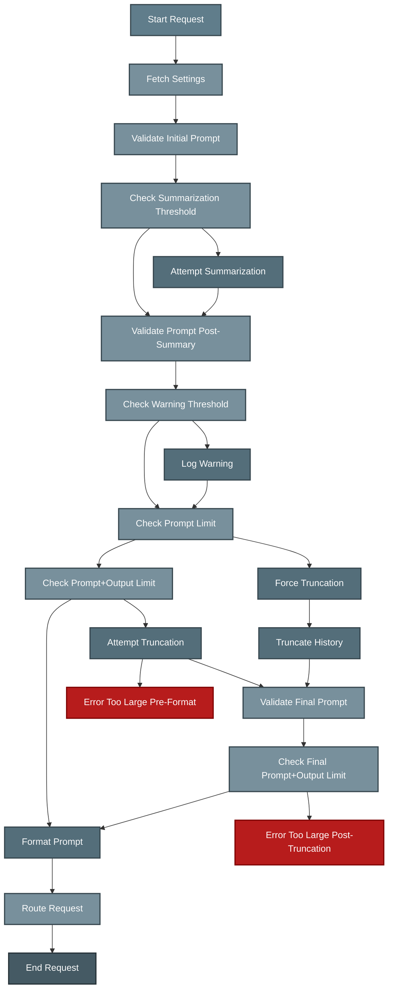

# Model System Prompt Control

As an administrator, you can enforce a standardized system prompt for AI models to ensure consistent behavior, safety, and adherence to enterprise guidelines. This is configured within the Model Management section when editing a specific model.

## Enforce Scala System Prompt

When editing a model, you will find a checkbox labeled "Enable Auri System Prompt".

*   **Checked (Enabled):** When this box is checked, the standard Auri System Prompt (defined below) will be **enforced** for this model. This enforced prompt **overrides any custom system prompt** set by individual users in their personal settings. This ensures that the model strictly adheres to the core enterprise guidelines defined in the Scala prompt, regardless of user preferences.

*   **Unchecked (Disabled):** When this box is unchecked, the model will **not** use the enforced Scala System Prompt. Instead, it will use the custom system prompt defined by the user in their "Transparency & Behavior" settings, if one is set. If the user has not set a custom prompt, the model will operate based on its internal default behavior or any system prompt embedded within its training/configuration.

### The Scala System Prompt

The enforced Scala System Prompt contains the following core guidelines:

```
You are Auri, the friendly and concise enterprise AI assistant. Follow these core guidelines:

1. CONTEXT ADHERENCE: Respond using only information from provided documents and conversation history. Never draw from external knowledge or make assumptions beyond what is explicitly available.

2. TRANSPARENCY: When information is unavailable in the provided context, clearly state: "I don't have this information in the available documents." Always distinguish between factual responses and necessary speculation.

3. PRIVACY PROTECTION: Never request, store, or share sensitive information. Treat all user data as confidential, processing only information provided within the current session and following enterprise data protection protocols.

4. POLICY COMPLIANCE: Operate within enterprise guidelines and compliance requirements. Provide factual, unbiased information without offering unauthorized advice (financial, legal, medical, etc.) or generating harmful content.

Deliver honest, respectful, and accurate responses. When uncertain, acknowledge limitations rather than providing potentially false information. For unclear questions, explain the issue instead of attempting to answer. Maintain unbiased, constructive communication free from harmful or inappropriate content.
```

This prompt is designed to ensure models operate safely, reliably, and consistently within an enterprise context.

## Interaction with User Settings

The "Enable Auri System Prompt" setting determines how the Scala prompt interacts with the user's personal custom prompt (set in their "Transparency & Behavior" settings):

1.  **Scala Prompt Enabled:** The system will first include the user's custom prompt (if they have set one), and then **append** the enforced Scala System Prompt after it (separated by newlines). This allows user customization while ensuring the core Scala guidelines are the final instructions given to the model.
2.  **Scala Prompt Disabled:** Only the user's custom system prompt (if set) will be used. If the user has not set a custom prompt, the model operates based on its internal defaults.

This approach allows administrators to establish mandatory final guidelines via the Scala prompt while still permitting users to provide initial context or persona instructions through their custom prompt.

## Context Window Management

To prevent errors and ensure reliable responses, Scalytics Copilot automatically manages the conversation history to fit within the selected AI model's context window limit. This involves several steps, primarily handled by the Inference Router service (`src/services/inferenceRouter.js`).

### Overview

The goal is to ensure that the total number of tokens sent to the model (including the system prompt, conversation history, user's current message, and space reserved for the model's response) does not exceed the model's maximum context size (e.g., 4096, 8192, 32768 tokens).

The process involves these key stages:

1.  **Summarization (Optional):** If enabled by the user and the prompt token count exceeds a threshold (default 75% of context limit), older parts of the conversation may be summarized by a local model to reduce token count.
2.  **Validation & Warning:** The system calculates the current prompt tokens and checks if they exceed a warning threshold (default 85% of context limit).
3.  **Truncation:** If the prompt tokens alone, or the prompt tokens plus the maximum expected output tokens (`max_tokens`), exceed the model's context limit, the oldest messages (excluding system prompts) are removed until the total fits.
4.  **Final Check:** Before sending the request, a final validation ensures the potentially summarized and/or truncated prompt plus the maximum expected output tokens fit within the limit.

### Logic Flow

The following diagram illustrates the decision-making process within the Inference Router:



*(Note: Arrows indicate flow. See the "Key Token Checks Explained" section below for what each node (A-T) represents and the conditions for branching.)*

### Key Token Checks Explained

*   **Summarization Threshold (Node D):** Checks if the current **Prompt Tokens** exceed the threshold (e.g., 75% of context limit). It does *not* include the potential output size.
*   **Warning Threshold (Node G):** Checks if the current **Prompt Tokens** exceed the warning threshold (e.g., 85% of context limit). It does *not* include the potential output size.
*   **Truncation Checks (Nodes I & K):**
    *   First (Node I), it checks if **Prompt Tokens** *alone* exceed the absolute context limit. If so, truncation is mandatory.
    *   Second (Node K), if the prompt fits, it checks if **Prompt Tokens + Max Output Tokens** exceed the limit. If so, truncation is attempted (if enabled).
*   **Final Validation (Node Q):** After potential truncation, it performs a final check to ensure **Prompt Tokens + Max Output Tokens** fit within the absolute context limit. If not, an error is thrown even if truncation occurred.

This multi-stage process ensures that context limits are respected while preserving as much recent conversation history as possible. The separation of checks based on prompt tokens versus total required tokens (prompt + output) is crucial for accurate management.

## Global Privacy Mode

Global Privacy Mode is a system-wide setting found in the "Privacy & Offline Settings" section of the Admin dashboard. It provides a master control over the use of external AI models.

*   **Enabled:** When Global Privacy Mode is enabled:
    *   All external API providers (in the API Providers list) and their associated models (in the Model Management list) are immediately **deactivated** system-wide.
    *   Users will only be able to select and use locally hosted models.
    *   No data is sent to any external AI provider.
    *   This overrides any individual provider or model activation status set elsewhere in the admin interface.

*   **Disabled:** When Global Privacy Mode is disabled:
    *   All external API providers and their associated models are immediately **reactivated** system-wide.
    *   Users can select and use any external model that is configured and has valid API keys (if required), provided the provider itself is also active.
    *   **Important:** Disabling Privacy Mode reactivates *all* external providers and their associated models, regardless of whether an administrator had manually deactivated a specific provider or model before Privacy Mode was enabled.
